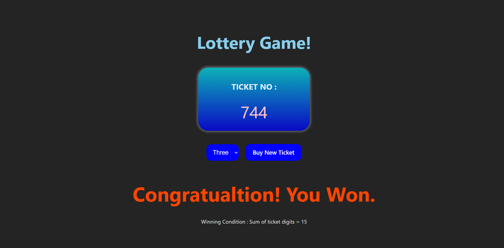

# 🎰 Lottery Game (React)

A simple Lottery Game built using React to practice core concepts like components, state, props, component decomposition, and lifting state up (state design pattern).

This project helped me understand how to structure a React app, manage shared state, and pass data between components.

---

## 🚀 Features

- 🎲 Random lottery number generation  
- 🧩 Component-based UI  
- 🔁 State management using React state  
- 🔼 Lifting state up to share data between components  
- 📦 Clean component decomposition  
- ⚡ Interactive UI  

---

## 🛠️ Tech Stack

- React  
- JavaScript (ES6+)  
- HTML5  
- CSS3  

---

## 📚 Concepts Practiced

- ✅ Components  
- ✅ Props  
- ✅ State  
- ✅ Component Decomposition  
- ✅ Lifting State Up (State Design Pattern)  
- ✅ Event Handling  

---

## 🎯 Learning Outcome

Through this project, I learned:

How to break UI into reusable components

How to pass data using props

How to manage state effectively

How to lift state up for shared logic

How React re-renders based on state changes

---

## 📸 Screenshots (Optional)

---

## 🧑‍💻 Author

Harshvardhan Raj
Web Developer

